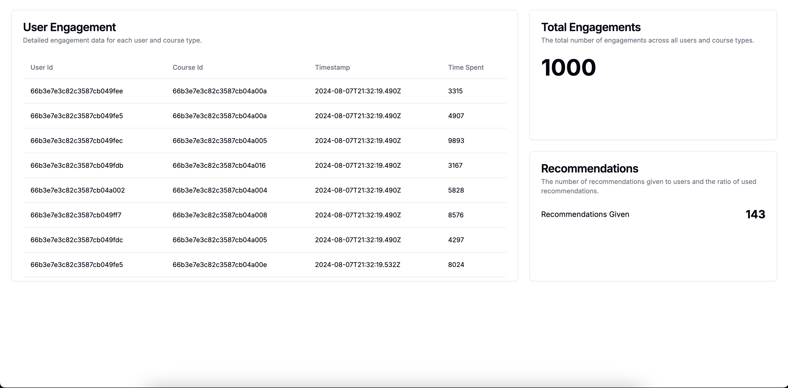

# Backend/Fullstack Engineer Take-Home Assignment

## Background

We are an online university of the 21st century. We want to use learners' engagement data from their learning activities to give recommendations about which courses to take next. For this purpose, we built a service and small dashboard around it for our product managers to look at.

## Tech Stack

This project uses the following technologies:

- TypeScript: For type-safe JavaScript development
- NextJS: A React framework for building full-stack web applications
- MongoDB: A NoSQL database for storing and retrieving data efficiently

These technologies were chosen for their scalability, performance, and developer-friendly features, which align well with our goal of creating a modern, data-driven education platform.

## Description of the Service

Simple TypeScript NextJS-based service containing a dashboard (app/page.tsx) to show data related to the service and 4 main endpoints (app/api/\*):

1. `GET /recommend/[userId]` - This endpoint creates and returns one recommendation based on userId and previously taken course types (use a simple heuristic).
2. `GET /recommendations` - This endpoint returns all the recommendations ever given.
3. `GET /engagements` - This endpoint returns all the engagements ever captured.
4. `GET /engage/[userId]/[courseId]` - This endpoint records one engagement.

Additional endpoints for debugging purposes:

- `GET /courses` - Show all courses
- `GET /users` - Show all users
- `GET /seed-data` - Populate db with seed data

## Setup

1. Fork this repo and clone it locally, run `npm i` to install the packages (Node 20+).
2. Set up a MongoDB Atlas account [here](https://www.mongodb.com/cloud/atlas/register) and create a free M0 cluster. Copy connection string for the cluster.
3. Create a `.env.local` file in the root directory with your MongoDB connection string (see `.env.example` for the format).
4. Run `npm run dev` to start the development server.
5. Invoke the `http://localhost:3000/seed-data` endpoint to populate your Cloud MongoDB with initial data.
6. Open `http://localhost:3000/` to see the dashboard

## Tasks

1. User Engagement Table Improvement:

   - In the dashboard (app/page.tsx), the User Engagement table currently contains User Id and Course Id as the first two columns.
   - Modify it to show user name and course title in the table instead of ids.

2. Recommendation Engine Effectiveness:

   - The `/recommend` endpoint contains a very simple heuristic about what to recommend.
   - Implement logic to calculate a metric for effectiveness of our recommendations.
   - Show this metric in the dashboard.

3. Course Performance Analysis:

   - Implement logic to determine our best and worst courses.
   - Show the top 3 and bottom 3 courses in the dashboard.

4. Production Readiness:

   - What needs to be done to make this service production ready?
   - Implement and/or document what you deem necessary. Consider aspects such as:
     - Error handling
     - Logging
     - Performance optimization
     - Security measures
     - Code organization

5. (Optional) Deployment:
   - Deploy your solution to [Vercel](https://vercel.com/docs/frameworks/nextjs).
   - Add the deployment link to your README file.

## Deliverable

- Share the forked private repository containing your implemented solution with @ishmidt-tou and @siddique-tou.
- Ensure the code can be run locally (given that the MongoDB connection string is provided).
- Include any of your notes, considerations, or things you wanted to do but didn't have time for in the README file.
- If you deployed it with Vercel, include the deployment link

## Evaluation Criteria

We want to see and understand:

1. Your ability to quickly understand a new codebase, adjust things, and create new functionality within the given code structure.
2. Your proficiency in working with data, transforming business needs into data-driven solutions.
3. Your coding skills, including code quality, documentation, and testing practices.
4. Your understanding of system design and architecture principles.
5. Your problem-solving approach and creativity in addressing the tasks.

## Time Expectation

We expect this assignment to take approximately 2-4 hours to complete. However, feel free to spend more time if you wish to add extra features or polish your solution.
Please complete the assignment within one week of receiving it.

## Notes/Considerations

[Add your notes, considerations, or things you wanted to do but didn't have time for here]
